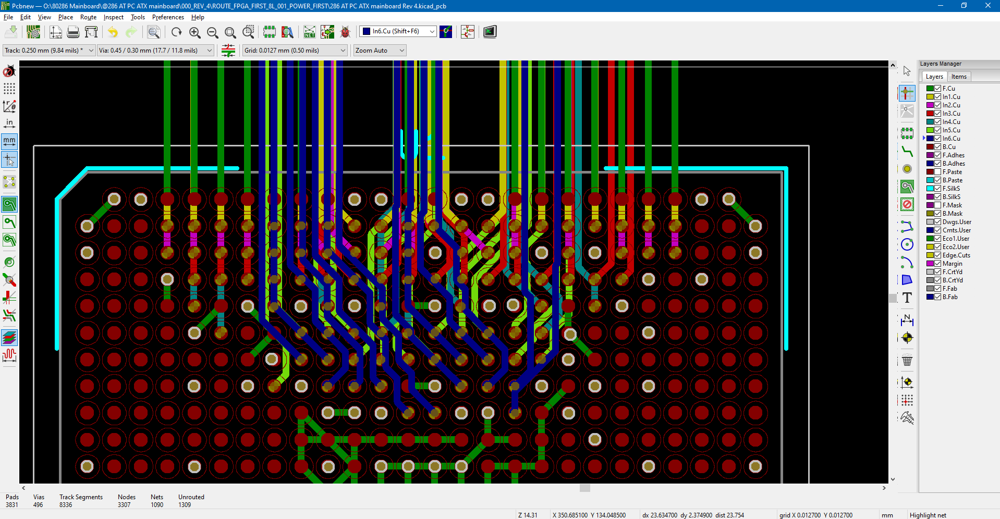

# ATX form factor 80286 AT mainboard PCB Rev 4

An ATX FPGA based PC/AT mainboard evolved from the IBM 5170 PC/AT design principles which drove the PC industry standard forward with much momentum.
A completely integrated PC/AT mainboard design using the 80286 CPU featuring a Cyclone II FPGA for bus logic, system control and much more.

## Current status(dec 2025): PCB and quartus project are under development.  

  

Keep an eye out at the bottom for the latest developments!  

## Purpose and permitted use, cautions for a potential builder of this design
This project was created for historical purposes out of love for historical computing designs and for the purpose of enabling computing enthousiasts with a sufficient level of building and troubleshooting expertise to be able to experience the technology by building and troubleshooting the hardware described in this project. Due to the level of this project, it may be suitable as a project for students to get into. If there are any questions from teachers who like to teach about this technology I would be happy to answer them. It may be really interesting to analyse the elaborate and complex CPU timing and 8 bit to 16 bit data byte translation and DMA mechanisms in an educational setting.

Besides the GPL3 license there are a few warnings and usage restrictions applicable:
No guarantees of function or fitness for any particular or useful purpose is given, building and using this design is at the sole responsibility of the builder.

Do not attempt this project unless you have the necessary electronics assembly expertise and experience, and know how to observe all electronics safety guidelines which are applicable.

It is not permitted to use the computer built from this design without the assumption of the possibility of loss of data or malfunction of the connected device. To be used strictly for personal hobby and experimental purposes only. No applications are permitted where failure of the device could result in damage or injury of any kind.

If you plan to use this design or any part of it in new designs, the acknowledgement of the designer and the design sources and inspirations, historical and modern, of all subparts contained within this design should be included and respected in your publication, to accredit the hard work, time and effort dedicated by the people before you who contributed to make your project possible.

No guarantee for any proper operation or suitability for any possible use or purpose is given, using the resulting hardware from this design is purely educational and experimental and not intended for serious applications. Loss of data is likely and to be expected when connecting any storage device or storage media to the resulting system from this design, or when configuring or operating any storage device or media with the system of this design.

When connecting this system to a computer network which contains stored information on it, it is at the sole responsibility and risk of the person making the connection, no guarantee is given against data loss or data corruption, malfunctions or failure of the whole computer network and/or any information contained inside it on other devices and media which are connected to the same network.

When building this project, the builder assumes personal responsibility for troubleshooting it and using the necessary care and expertise to make it function properly as defined by the design. You can email me with questions, but I will reply only if I have time and if I find the question to be valid. Which will probably also lead to an update here. I want to primarily dedicate my time to new project development, I am not able to do any user support, so that's why I provide the elaborate info here which will be expanded if needed.

# Acknowledgements

Special thanks to
- sqpat for his essential support of all my PC/AT related work!
- kevju on VCF forum for giving me some useful time saving FPGA tips
- IBM corporation - the PC team led by Don Estridge
- Intel corporation for creating these awesome legacy processors without which the PC/AT would not have existed!
- see the PC/AT V1 project for many more people who all gave their support and inspired me greatly!

Also a special thanks goes out to user LimeProgramming (Adam) here on GitHub for making his excellent USB to serial mouse project with the RP2040!
https://github.com/LimeProgramming/USB-serial-mouse-adapter
He kindly agrees for his project to be integrated into mine in a modified form, thank you Adam!

Thanks to sqpat for the friendly discussions and resulting joint effort to develop the REV3D EMS system and driver written by sqpat, now fully supporting RealDOOM, and to be continued here in the REV4 FPGA system of course. I thank sqpat for sending me more clock speed verified Harris 286 CPUs to use in the projects, and several PC/AT chipset mainboards for testing and evaluation. Do remember to check out [his project RealDoom here on GitHub](https://github.com/sqpat/RealDOOM)!

Acknowledgements of people who were instrumental in preceeding developments upon which this design was elaborated:

[Don Estridge](https://www.ibm.com/ibm/history/exhibits/builders/builders_estridge.html)
[IBM PC development team](https://www.ibm.com/ibm/history/exhibits/pc25/pc25_birth.html)
[Some historical info](https://arstechnica.com/gadgets/2017/06/ibm-pc-history-part-1/)
[Bill Lowe](https://www.ibm.com/ibm/history/exhibits/builders/builders_lowe.html)

[XT-IDE universal BIOS project development team for developing the XT-IDE BIOS](https://www.xtideuniversalbios.org)
Amazing and extremely efficient software, fast disk access for XT and various AT computers.
Works with every IDE drive I have tested. Still under active development earlier in 2023.

All source data remains the copyright of the original creators and must be respected.
This design is only released for hobby computing enthousiasts and educational purposes, no profit is to be made from this design or derived work from it.

## Project outline  

This project is the 4th revision of my PC/AT development work, which started out by the REV1 recreation and reverse engineering work to rebuild a PC/AT based on the IBM 5170 using CPLD technology.  

I then proceeded to develop system control replacement in the CPLDs, extensively rewiring the REV1 PCB, after which I then assembled REV2 intermediate designs to reflect all the developed improvements and upgrades.  

I then decided to release a final CPLD based mainboard project, the REV3D system, also fully featured here on GitHub.
Using CPLDs for this project was both frustrating and difficult because of logic limitations, however I finally managed to do it!
So the REV3D system reflects a really stable and almost fully integrated complete implementation of a 80286 based PC/AT based on the IBM 5170, which now is able to run at 22.4MHz, including to run windows and RealDOOM as created by sqpat and featured here on GitHub.  
Recommended VGA card is a cirrus logic, if possible a Diamond Speedstar pro.  

After finalizing the REV3D project by supporting to run RealDOOM on the system with the kind assistance of sqpat here on GitHub, I have conceived a fully integrated PC/AT system which implemented all the bus logic inside the 5 CPLD chips on the REV3D board. The resulting design created a rock solid stable PC mainboard and served as the preparation basis for now developing this FPGA stage design.  

In this FPGA stage we will attempt to replace some of the PC/AT core controllers with FPGA recreations using a Cyclone II BGA chip with 672 pins. Other goals are a higher degree of system control, increasing both efficiency and clock speed of the Harris 80286 CPU.  

## Project implementation  

So far I have determined that the mainboard is going to need 8 layers to be able to bring out all the 450 user IO and for connecting the power supply voltages and other support pins for the FPGA chip.
I am currently working on the PCB routing for the FPGA chip where the focus is on creating the connectivity into the chip, after which I will route the FPGA into FET bus switch logic ICs which then will interface between the selected 3.3V IO voltage of the FPGA and the 5V based PC/AT system and ISA slot connectors.

Thank you for your interest in reading this project description, more details will follow on this page shortly!

Kind regards,

Rodneys

Last updated december 1st, 2025.
