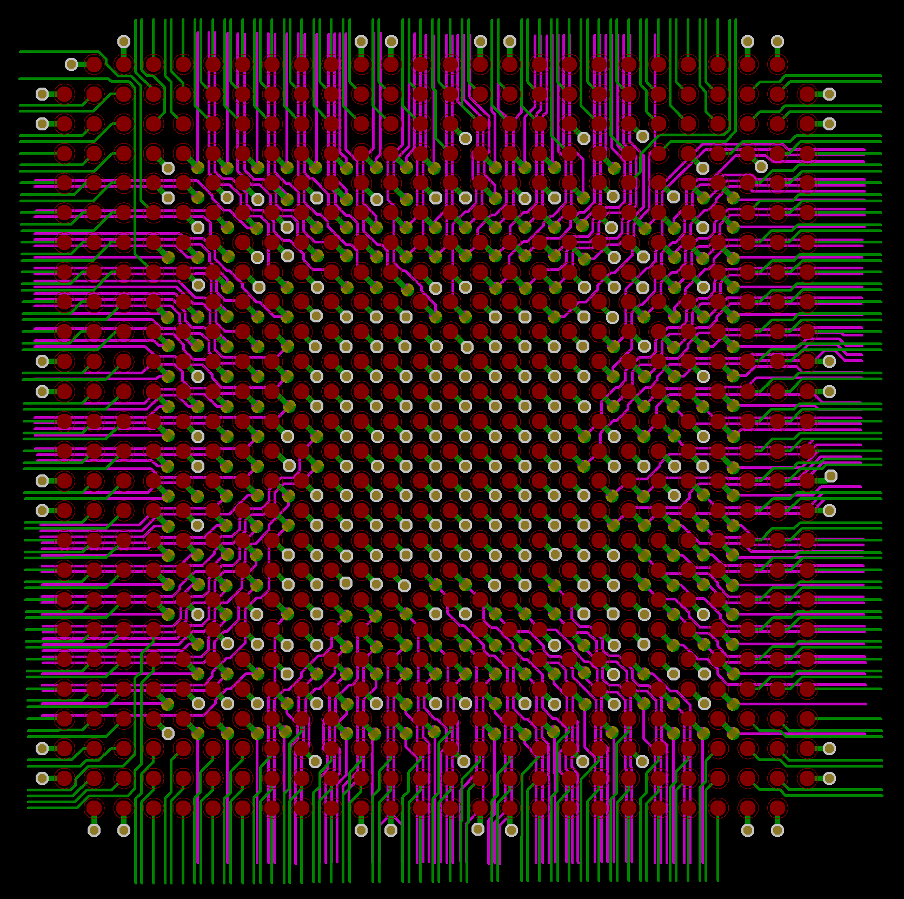

# ATX form factor 80286 AT mainboard Rev 4

An ATX FPGA based PC/AT mainboard evolved from the IBM 5170 PC/AT design principles which drove the PC industry standard forward with much momentum.
A completely integrated PC/AT mainboard design using the 80286 CPU featuring a Cyclone II FPGA for bus logic, system control and much more.

## Current status(dec 2025): PCB and quartus project are under development.  

  

Keep an eye out at the bottom for the latest developments!  

## Purpose and permitted use, cautions for a potential builder of this design
This project was created for historical purposes out of love for historical computing designs and for the purpose of enabling computing enthousiasts with a sufficient level of building and troubleshooting expertise to be able to experience the technology by building and troubleshooting the hardware described in this project. Due to the level of this project, it may be suitable as a project for students to get into. If there are any questions from teachers who like to teach about this technology I would be happy to answer them. It may be really interesting to analyse the elaborate and complex CPU timing and 8 bit to 16 bit data byte translation and DMA mechanisms in an educational setting.

Besides the GPL3 license there are a few warnings and usage restrictions applicable:
No guarantees of function or fitness for any particular or useful purpose is given, building and using this design is at the sole responsibility of the builder.

Do not attempt this project unless you have the necessary electronics assembly expertise and experience, and know how to observe all electronics safety guidelines which are applicable.

It is not permitted to use the computer built from this design without the assumption of the possibility of loss of data or malfunction of the connected device. To be used strictly for personal hobby and experimental purposes only. No applications are permitted where failure of the device could result in damage or injury of any kind.

If you plan to use this design or any part of it in new designs, the acknowledgement of the designer and the design sources and inspirations, historical and modern, of all subparts contained within this design should be included and respected in your publication, to accredit the hard work, time and effort dedicated by the people before you who contributed to make your project possible.

No guarantee for any proper operation or suitability for any possible use or purpose is given, using the resulting hardware from this design is purely educational and experimental and not intended for serious applications. Loss of data is likely and to be expected when connecting any storage device or storage media to the resulting system from this design, or when configuring or operating any storage device or media with the system of this design.

When connecting this system to a computer network which contains stored information on it, it is at the sole responsibility and risk of the person making the connection, no guarantee is given against data loss or data corruption, malfunctions or failure of the whole computer network and/or any information contained inside it on other devices and media which are connected to the same network.

When building this project, the builder assumes personal responsibility for troubleshooting it and using the necessary care and expertise to make it function properly as defined by the design. You can email me with questions, but I will reply only if I have time and if I find the question to be valid. Which will probably also lead to an update here. I want to primarily dedicate my time to new project development, I am not able to do any user support, so that's why I provide the elaborate info here which will be expanded if needed.

# Acknowledgements

Special thanks to
- sqpat for his essential support of all my PC/AT related work! And of course for his work on the RealDOOM project!
- kevju on the VCF forum for giving me some useful time-saving FPGA tips about various topics including the usage of FET based bus switch and level conversion ICs and very helpful BGA PCB layout tips, FPGA power regulators.
- marshallh on the VCF forum for giving me a lot of additional advice regarding FPGAs and Altera Cyclone chips, configuring the FPGA, usage of flash configuration ICs, and more.
- IBM corporation - the PC team led by Don Estridge  
- Intel corporation for creating these awesome legacy processors without which the PC/AT would not have existed!  
- see the PC/AT V1 project for many more people who all gave their support and inspired me greatly!  
- costastep here on GitHub for providing useful ideas and background, see the "issue" thread  
- htminuslab (Hans Tiggeler) for creating such clear and transparent examples of the core AT controllers in HDL which inspired a lot of confidence on closer look at the code  

Also a special thanks goes out to user LimeProgramming (Adam) here on GitHub for making his excellent USB to serial mouse project with the RP2040!
https://github.com/LimeProgramming/USB-serial-mouse-adapter
He kindly agrees for his project to be integrated into mine in a modified form, thank you Adam!

Thanks to sqpat for the friendly discussions and resulting joint effort to develop the REV3D EMS system and driver written by sqpat, now fully supporting RealDOOM, and to be continued here in the REV4 FPGA system of course. I thank sqpat for sending me more clock speed verified Harris 286 CPUs to use in the projects, and several PC/AT chipset mainboards for testing and evaluation. Do remember to check out [his project RealDoom here on GitHub](https://github.com/sqpat/RealDOOM)!

Acknowledgements of people who were instrumental in preceeding developments upon which this design was elaborated:

[Don Estridge](https://www.ibm.com/ibm/history/exhibits/builders/builders_estridge.html)  
[IBM PC development team](https://www.ibm.com/ibm/history/exhibits/pc25/pc25_birth.html)  
[Some historical info](https://arstechnica.com/gadgets/2017/06/ibm-pc-history-part-1/)  
[Bill Lowe](https://www.ibm.com/ibm/history/exhibits/builders/builders_lowe.html)  

[XT-IDE universal BIOS project development team for developing the XT-IDE BIOS](https://www.xtideuniversalbios.org)  
Amazing and extremely efficient software, fast disk access for XT and various AT computers.
Works with every IDE drive I have tested. Still under active development earlier in 2023.  

All source data remains the copyright of the original creators and must be respected.  

This design is only released for hobby computing enthousiasts and educational purposes, no profit is to be made from this design or derived work from it.  

## Project outline  

This project is the 4th revision of my PC/AT development work, which started out by the REV1 recreation and reverse engineering work to rebuild a PC/AT based on the IBM 5170 using CPLD technology.  

I then proceeded to develop system control replacement in the CPLDs, extensively rewiring the REV1 PCB, after which I then assembled REV2 intermediate designs to reflect all the developed improvements and upgrades.  

I then decided to release a final CPLD based mainboard project, the REV3D system, also fully featured here on GitHub.  
Using CPLDs for this project was both frustrating and difficult because of logic limitations, however I finally managed to do it!
So the REV3D system reflects a really stable and almost fully integrated complete implementation of a 80286 based PC/AT based on the IBM 5170, which now is able to run at 22.4MHz, including to run windows and RealDOOM as created by sqpat and featured here on GitHub.  
Recommended VGA card is a cirrus logic, if possible a Diamond Speedstar pro.  

After finalizing the REV3D project by supporting to run RealDOOM on the system with the kind assistance of sqpat here on GitHub, I have conceived a fully integrated PC/AT system which implemented all the bus logic inside the 5 CPLD chips on the REV3D board. The resulting design created a rock solid stable PC mainboard and serves as the preparation basis for now developing this FPGA stage design.  

In this FPGA stage we will attempt to replace some of the PC/AT core controllers with FPGA recreations using a Cyclone II BGA chip with 672 pins. Other goals are a higher degree of system control, increasing both efficiency and clock speed of the Harris 80286 CPU.  

## Project implementation  

I have changed the new mainboard PCB layout to include micro traces underneath the 672 pin BGA FPGA chip thanks to the suggestions of kevju on the VCF forum thread.
This now enabled the layout to be realized in only 4 layers instead of needing 8, which will substantially reduce the PCB manufacturing costs for this system. 

This REV4 FPGA iteration of the PC/AT development is not intended to become a pure FPGA/VHDL/Verilog based project because this would resemble emulation too much. Pure code based systems tend to progress into alternate structures where the original logic is lost and replaced by reduced versions in logic code. Examples can be found in combined projects that have the purpose of replacing an entire PC. So the system then becomes more an optimized description version where parts are no longer present. In this project we will aspire to retain a large part of the original 5170 system structure, as much as possible. The FPGA will still be based on a block design file which will serve as system control logic and bus interconnect amongst other things. At the same time we will have the power of FPGA logic to offer support to the PC/AT system. So this implementation is intended to be more nuanced where we only apply hardware language to replace components in the system of which the original circuits are unknown. In other words we have no alternative than to replace with hardware description language. A prime example of this are the core PC/AT controller chips, the 8042, 8237, 8259, 8254, RTC chip etc. These designs are unknown so we have no choice other than using VHDL/Verilog equivalents to perform those functions and integrate those controllers. However there we also will prefer to find code examples that make an effort to approximate the original function of the controller chip as accurately and completely as possible. So a higher level of integration is one of the design goals of this project.

The FPGA chip has been fully routed now and ready to be wired into the system on the mainboard so the focus is also returned on elaborating the FPGA quartus project again and choosing the pin layout of the FPGA.  At the same time the mainboard layout will be developed/updated where we add level shifters and bus switch ICs to interface with the 5V logic connections of the system.

So far we have removed the 74LS612 DMA page mapper and EMS page register SRAMs and replaced these in the FPGA project since now in the FPGA we have sufficient logic to replace these.

Next I searched GitHub for a suitable 8237 DMAC replacement which I may have found in the very promising project by htminuslab, found at:
https://github.com/htminuslab/HTL8237
This project is different from most others where the creator has aspired to design the project very much true to the original 8237 DMA controller, which is very commendable!

So I have worked to include the VHDL code of the HTL8237 project in our FPGA quartus project, which has now succeeded to compile the two DMAC ICs into the project and fully connect them to replace the functions. So we will try to use these code based DMA controllers instead of the originals and I have removed the DMAC ICs from the board. This also changes the DMA connectivity a lot so the board and quartus projects have been reworked to reflect the changes. The project is provisional to first determine to what level we will be able to replace core controllers, and then the focus will be to go over the entire project and verify everything. Currently the FPGA logic consumption with both HTL8237 DMACs included is around 5%. 

## Project update 4-1-2026
I have searched more source code examples of recreations of the core AT controller IC replacements in order to integrate these into the one chip design Altera FPGA.
So what I found so far is:

htminuslab - Hans Tiggeler:  
HTL8237  
HTL8259  
HTL8254  
HTL146818  
ao486 project - Aleksander Osman:
AO486 - PS2 keyboard/mouse controller (to be verified with MR BIOS!)  

I am working to integrate these into my single chip FPGA design and their original licenses can be found in the component subdirectories of the finished quartus projects.
The source HDL code folders which have so far been found the most promising have been size reduced and uploaded here as ZIP files.  

The reason for reducing the folder sizes is to be able to create a smaller complete quartus archive, please refer to search the similar named repositories here on GitHub where you can find the full details and elaborate documents etc provided by the original creators!

I will contact the makers when this project is further along so it can better illustrate how the code would be used in this project.
If you come across this project, thank you to all the creators for making these HDL recreations!

So far the plan is to use these core AT controller HDL components, however if we could some day obtain the HDL sources used in originals, that would be even more amazing if these could be included.
The idea was kindly suggested by costastep here on GitHub, thanks!  

This project aims particularly for historical authenticity and also attempts to keep the PC/AT structure as created in the 5170 system preserved as much as possible and the necessary/desired functionality permits.
We want to preserve these historic systems as much as possible and for this reason I will attempt to combine HDL components with a quartus block design schematic which joins the complete system together.
I am aware that this is not the advisable strategy of design but I will give it my best attempt to make this structure work correctly rather than resorting to a completely HDL based implementation which would subsequently provide much less insight into the original underlying technology. I may look into getting a kind of complete block schematic from HDL-only code which may also somewhat suffice in the latter case if this proves necessary to go that path.

I am currently processing all the design elements in quartus, and assembling the PCB layout at the same time.
After I get the pin configuration more complete, I will be able to determine a more definite location/orientation for the FPGA and more complete connectivity of the FPGA chip on the mainboard.

In future plans I may also work on a PCI bus, or possibly to include the functionality of a fast VGA controller IC in the FPGA, which may make implementing PCI less urgent or critical to speed up the system.
I have done some provisional reading about PCI and so far it looks like there will be some "intelligence" and arbitration required to control PCI cards, some memory to store the PCI functionality and data, caching for relaying the PCI data and of course, very important, BIOS support for the PCI functions. It seems that a FPGA would be very suitable, however the question is how to get to a full design, and whether the FPGA could provide sufficient free logic and memory space for the functions. PCI would need to interact with the interrupt controllers etc to drive the core AT interrupt inputs of the 8259 controllers so these can direct the CPU correctly. There is a lot involved and I am somewhat wondering whether a 286 CPU would be able to efficiently interact with a PCI BUS controller and the PCI cards it controls. Though I certainly would not want to exclude that this could be possible. There would be a lot of byte and memory space translation involved, though apparently a PCI bus is theoretically able to operate at any clock speed in the later iterations of the PCI standard.

It's not excluded that the development work in this project may lead to an additional FPGA being used in the system at a later stage, for example for providing VGA video output.

Thank you to all visitors here and in my other PC/AT projects for your interest in reading this project description, more details will follow on this page as soon as I have them!

Kind regards,

Rodney

Last updated january 4th, 2026.
